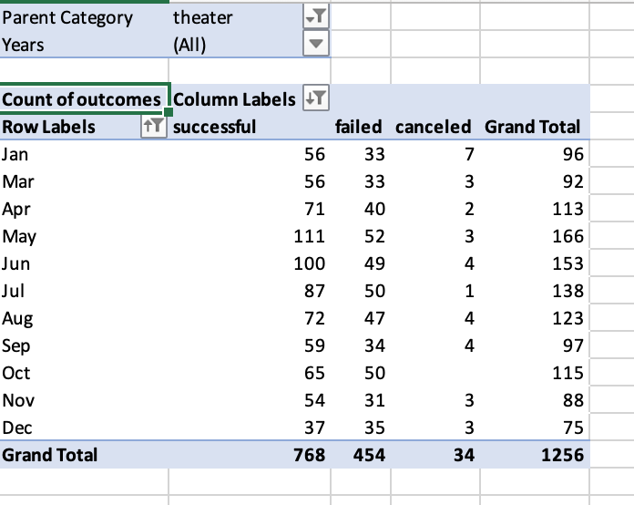
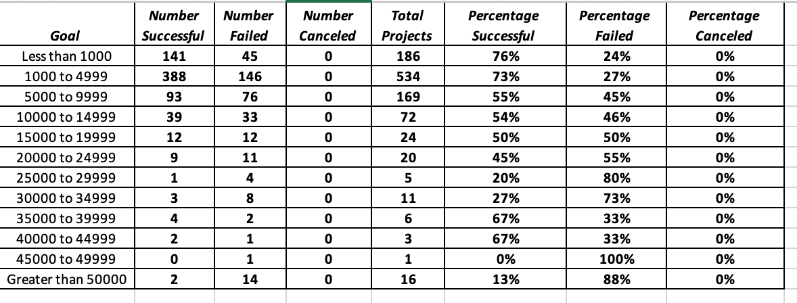

# An Analysis of Kickstarter Campaigns

### Table of Contents
- [1 Overview of Project](#1-overview-of-project)
  - [1.1 Purpose](#11-purpose)
  - [1.2 Tools Required](#12-tools-required)
-  [2 Analysis & Challenges](#2-analysis--challenges)
  -  [2.1 Outcomes Based on Launch Date](#21-outcomes-based-on-launch-date)
  -  [2.2 Outcomes Based on Goals](#22-outcomes-based-on-goals)
  -  [2.3 Challenges](#23-challenges)
-  [3 Results](#3-results)

## 1 Overview of Project

This analysis was originally conducted to assist a playwright, Louise, who was interested in starting a crowdfunding campaign to help fund her play, *Fever*. Excel was used to organize, sort, and analyze crowdfunding data to determine whether there are specific factors that make a fundraising campaign successful. Due to preliminary findings, Louise's play, *Fever*, came close to its fundraising goal in a short amount of time. 

### 1.1 Purpose 

Using insights derived from Excel, the purpose of this project is to help Louise determine how different campaigns fared in relation to their launch date and funding goals. Using the Kickstarter dataset, two technical requirements needed to be met to fulfill Louise's data request:

- Create an *Outcomes vs Launch Date* Chart
- Create an *Outcomes Based on Goals* Chart

### 1.2 Tools Required 

- Excel (version 16 or later)

## 2 Analysis & Challenges 

### 2.1 Theater Outcomes Based on Launch Date

Using a pivot table and graphing functionalities in Excel, a visualization was created to show campaign outcomes ("successful", "failed", and "canceled") in relation to its launch date. 

To create this chart, in the **Kickstarter** dataset, a *Years* column was added to the Kickstarter worksheet to extract the year from the *Date Created Conversion* column using the `YEAR()` function. A pivot table was created based on all the contents of the Kickstarter worksheet, including the new Year column. The table below depicts the categories and its designated field name(s) used to create the pivot table for this analysis: 

Filters | Columns | Rows | Values
------- | ------- | ---- | ------
Parent Category, Years | Outcomes | Date Created Conversion | *Count of* Outcomes

Once the pivot table is created, group the row labels column by month to clean up the data. The parent category filter should then be adjusted to only show results for the **Theater** category like the image below: 

Note, Louise is only interested in data for campaigns that already completed and are listed as either "successful", "failed", or "canceled" - ensure column labels do **not** include "live" campaigns. Then, sort campaign outcomes in descending order so "successful" appears first. 

Lastly, a line chart was created from the pivot table to visualize the relationship between theater campaign outcomes and their launch dates. 

### 2.2 Theater Outcomes Based on Goals

The Outcomes Based on Goals chart was created using the percentages of successful, failed, and canceled plays based on the funding goal amount. In a new sheet, a new table was created with the following column names: 

- Goal
- Number Successful
- Number Failed
- Number Canceled
- Total Projects
- Percentage Successful
- Percentage Failed
- Percentage Canceled

In the goal column, goal amounts were grouped into the following ranges: 

- Less than 1000
- 1000 to 4999
- 5000 to 9999
- 10000 to 14999
- 15000 to 19999
- 20000 to 24999
- 25000 to 29999
- 30000 to 349999
- 35000 to 39999
- 40000 to 44999
- Greater than 50000

Using the `COUNTIFS()` function, the number successful, failed, and canceled were calculated using the ranges listed in the Goal column, filtering the Outcome column, and the Subcategory column using *plays* as the criteria. To calculate the number of total projects, the `SUM()` function was used to add up the number of projects that were deemed a success, a failure, or a cancellation. Then, the percentage of each outcome was calculated for each type of outcome. The full table is shown below: 

A line chart was then created to view the relationship between goal range and percentage of successful, failed, and canceled projects. 

### 2.3 Challenges

Potential challenges one could run into when performing this type of analysis is ensuring that the appropriate function is used, understood, and implemented correctly to achieve the desired [results](#3-results) with its corresponding data. If the sequence for the Excel function is not thoroughly understood, inputting the incorrect cells or cell ranges could be detrimental to your project and paint an inaccurate representation of the data. 

## 3 Results 

