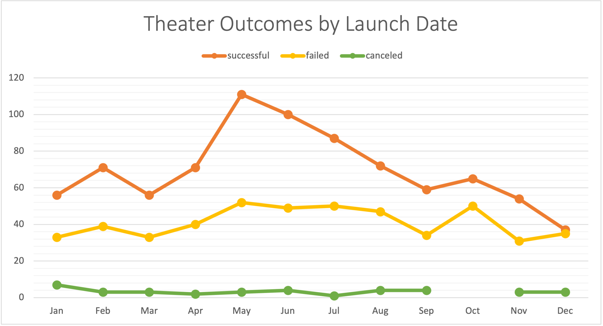
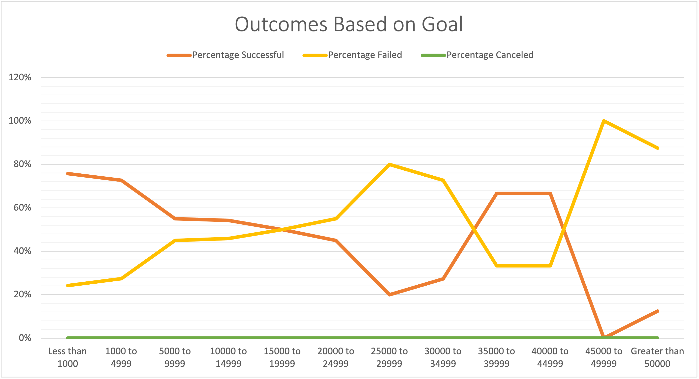

# An Analysis of Kickstarter Campaigns

### Table of Contents
- [1 Overview of Project](#1-overview-of-project)
  - [1.1 Purpose](#11-purpose)
  - [1.2 Tools Required](#12-tools-required)
- [2 Analysis & Challenges](#2-analysis--challenges)
  - [2.1 Theater Outcomes By Launch Date](#21-theater-outcomes-by-launch-date)
  - [2.2 Outcomes Based on Goals](#22-outcomes-based-on-goals)
  - [2.3 Challenges](#23-challenges)
-  [3 Results](#3-results)
     - [3.1 Theater Outcomes by Launch Date](#31-theater-outcomes-by-launch-date)
      - [3.2 Outcomes Based on Goals](#32-outcomes-based-on-goals)
     - [3.3 Limitations](#33-limitations)
      - [3.4 Other Visualizations](#34-other-visualizations)

## 1 Overview of Project

This analysis was originally conducted to assist a playwright, Louise, who was interested in starting a crowdfunding campaign to help fund her play, *Fever*. Excel was used to organize, sort, and analyze crowdfunding data to determine whether there are specific factors that make a fundraising campaign successful. Due to preliminary findings, Louise's play, *Fever*, came close to its fundraising goal in a short amount of time. 

### 1.1 Purpose 

Using insights derived from Excel, the purpose of this project is to help Louise determine how different campaigns fared in relation to their launch date and funding goals. Using the Kickstarter dataset, two technical requirements needed to be met to fulfill Louise's data request:

- Create an *Outcomes vs Launch Date* Chart
- Create an *Outcomes Based on Goals* Chart

### 1.2 Tools Required 

- Excel (version 16 or later)

## 2 Analysis & Challenges 

### 2.1 Theater Outcomes by Launch Date

Using a pivot table and graphing functionalities in Excel, a visualization was created to show campaign outcomes ("successful", "failed", and "canceled") in relation to its launch date. 

To create this chart, in the **Kickstarter** dataset, a *Years* column was added to the Kickstarter worksheet to extract the year from the *Date Created Conversion* column using the `YEAR()` function. A pivot table was created based on all the contents of the Kickstarter worksheet, including the new Year column. The table below depicts the categories and its designated field name(s) used to create the pivot table for this analysis: 

Filters | Columns | Rows | Values
------- | ------- | ---- | ------
Parent Category, Years | Outcomes | Date Created Conversion | *Count of* Outcomes

Once the pivot table is created, group the row labels column by month to clean up the data. The parent category filter should then be adjusted to only show results for the **Theater** category like the image below: 

Note, Louise is only interested in data for campaigns that already completed and are listed as either "successful", "failed", or "canceled" - ensure column labels do **not** include "live" campaigns. Then, sort campaign outcomes in descending order so "successful" appears first. 

Lastly, a line chart was created from the pivot table to visualize the relationship between theater campaign outcomes and their launch dates. 

### 2.2 Outcomes Based on Goals

The Outcomes Based on Goals chart was created using the percentages of successful, failed, and canceled plays based on the funding goal amount. In a new sheet, a new table was created with the following column names: 

- Goal
- Number Successful
- Number Failed
- Number Canceled
- Total Projects
- Percentage Successful
- Percentage Failed
- Percentage Canceled

In the goal column, goal amounts were grouped into the following ranges: 

- Less than 1000
- 1000 to 4999
- 5000 to 9999
- 10000 to 14999
- 15000 to 19999
- 20000 to 24999
- 25000 to 29999
- 30000 to 349999
- 35000 to 39999
- 40000 to 44999
- Greater than 50000

Using the `COUNTIFS()` function, the number successful, failed, and canceled were calculated using the ranges listed in the Goal column, filtering the Outcome column, and the Subcategory column using *plays* as the criteria. To calculate the number of total projects, the `SUM()` function was used to add up the number of projects that were deemed a success, a failure, or a cancellation. Then, the percentage of each outcome was calculated for each type of outcome. The full table is shown below: 

A line chart was then created to view the relationship between goal range and percentage of successful, failed, and canceled projects. 

### 2.3 Challenges

Potential challenges one could run into when performing this type of analysis is ensuring that the appropriate function is used, understood, and implemented correctly to achieve the desired [results](#3-results) with its corresponding data. If the sequence for the Excel function is not thoroughly understood, inputting the incorrect cells or cell ranges could be detrimental to your project and paint an inaccurate representation of the data. 

## 3 Results 

### 3.1 Theater Outcomes By Launch Date

The month of May had the most number of campaigns launched throughout the month (166) and therefore had the most successful number of projects (111) (and the most number of failed projects - 52). June had the second most amount of theater Kickstarter campaign launches (153), where 100 of them were successful and 49 failed. Alternatively, November and December had the least amount of Kickstarter launches and thus had the least amount of successful campaigns. 

No Kickstarter campaigns were launched in the month of February; potentially due to February being the shortest month of the year and the season that February falls in does not seem to generally carry a large amount of campaigns overall. The month of January and March have the same amount of successful *and* failed campaigns. However, January has the greatest number of failed campaigns of all 12 months. Conversely, October has zero cancelled campaigns. 

Generally, there does not seem to be a noticeable pattern of canceled campaigns based on month; however, while May and June both have the highest number of launched campaigns throughout the year, they have a similar number of cancellations compared to the rest of the sample size. 

### 3.2 Outcomes Based on Goals

Based on the chart above, the most successful number of campaigns had a goal funding amount of less than $1,000 - followed by campaigns with a goal between $1,000 to $4,999 (<$1000 had a 76% success rate and $1000-$4999 had a 73% success rate). On the other hand, campaigns with a funding goal amount of greater than $50,000 had the least number of campaigns with that funding goal range (16), the second lowest percentage of successful projects (13%), but the second highest percentage of failed ones (88%).

Ultimately, based on the data, it can be generally assumed that lower goals - less than $4,999 - have a higher chance of succeeding as opposed to higher ones - >= $45,000. 

### 3.3 Limitations 

Some limitations to this Kickstarter dataset are timeframe and lack of data updates. The most recent creation date for any Kickstarter campaign within the dataset was in 2017 which could provide an inaccurate and out-of-date portrayal of campaign success. Due to the COVID-19 pandemic, this data could paint a different representation of the state of Kickstarter campaigns if the data included campaigns through 2020. It can be assumed that this additional information could have provided Louise with more context of how *Fever* would fare in the current state of the economy. 

### 3.4 Other Visualizations 

Other visualizations and tables that could provide additional insight for Louise are:

*Theater Outcomes based on Number of Backers*

This table and visualization could reinforce previous findings that certain months throughout the year are more likely to attract a greater number of backers as opposed to other months. This data could give Louise some perspective of how her campaign backers fared against others. 

*Theater Outcomes based on Average Donation*

This table and visualization could provide interesting information for Louise to see how other campaigns fared against *Fever* in average donations. Since Louise had come close to her fundraising goal, it could provide additional insight on her donors and determine whether there is a correlation between time of year and the average donation amount. 
